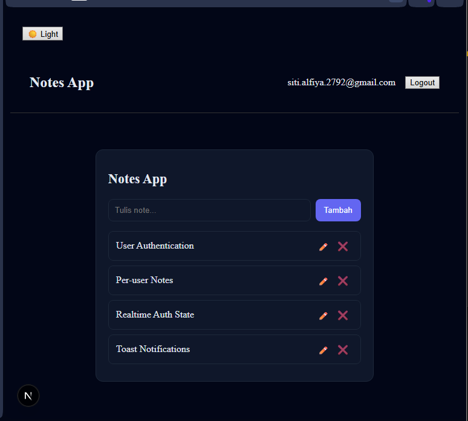

# 📝 Next.js Notes App

A modern fullstack Notes Application built with Next.js App Router, Prisma, Supabase Authentication, and PostgreSQL.

This project was created as a learning journey to deeply understand modern fullstack web development concepts such as authentication, authorization, database ownership, SSR hydration, reusable architecture, and deployment workflows.

---

# 🚀 Live Demo

🔗 [https://nextjs-notes-app-seven.vercel.app]

---

# ✨ Features

## 🔐 Authentication

* User Sign Up
* User Login
* User Logout
* Session Persistence
* Realtime Auth State

## 📝 Notes Management

* Create Notes
* Edit Notes
* Delete Notes
* Per-user Notes Isolation
* Notes ordered by latest first

## 🛡️ Security

* Authorization checks for update/delete
* Supabase Row Level Security (RLS)
* Protected user ownership flow

## 🎨 User Experience

* Global Navbar
* Toast Notifications
* Empty State UI
* Loading State UI
* Smooth Auth Redirect Flow

## 🏗️ Architecture

* Custom React Hooks
* Reusable Components
* Separation of UI and Business Logic
* API Route Structure

---

# 🧰 Tech Stack

## Frontend

* Next.js 16 (App Router)
* React
* TypeScript

## Backend

* Next.js API Routes
* Prisma ORM

## Database & Auth

* PostgreSQL
* Supabase Authentication
* Supabase RLS Policies

## Deployment

* Vercel

## UI & Utilities

* react-hot-toast

---

# 📂 Project Structure

```bash
app/
 ├── api/
 ├── auth/
 ├── components/
 ├── hooks/
 ├── layout.tsx
 └── page.tsx

lib/
 ├── prisma.ts
 └── supabase.ts

prisma/
 └── schema.prisma
```

---

# 🧠 What I Learned

This project helped me understand:

* Fullstack application architecture
* Authentication & session flow
* Authorization & ownership security
* CRUD operations with Prisma
* Database relationships and RLS
* Client vs Server rendering concepts
* React custom hooks architecture
* Production deployment & debugging
* Environment variables management
* SSR hydration issues in Next.js

---

# ⚙️ Local Development

## 1️⃣ Clone repository

```bash
git clone https://github.com/Desul27/nextjs-notes-app.git
```

## 2️⃣ Install dependencies

```bash
npm install
```

## 3️⃣ Setup environment variables

Create `.env` file:

```env
DATABASE_URL="postgresql://postgres.muuvpzpgdfbpunfvpikf"
NEXT_PUBLIC_SUPABASE_URL="https://muuvpzpgdfbpunfvpikf.supabase.co"

```

## 4️⃣ Push Prisma schema

```bash
npx prisma db push
```

## 5️⃣ Run development server

```bash
npm run dev
```

---

# 📸 Screenshot



---

# 📌 Future Improvements

* Search Notes
* Categories / Tags
* Rich Text Editor
* Profile Avatar
* Mobile UI Improvements
* Middleware-based SSR Auth Protection

---

# 🙌 Acknowledgements

Built with modern web technologies while learning fullstack development step by step.

---

# 📄 License

This project is open-source and available for learning purposes.
